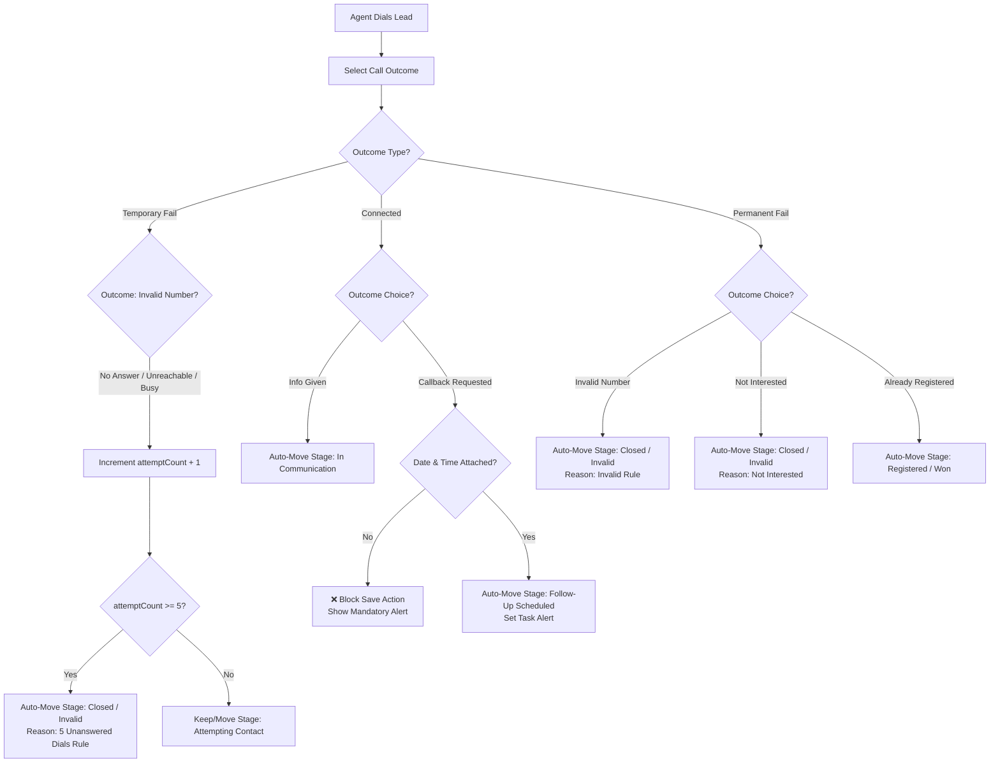

# Call Center Pipeline Stages, Call Outcomes & Automation Rules Specification

## 1. Executive Summary & Objective

This document outlines the standard operational blueprint and automated system rules for the Call Center CRM. The objective is to maximize lead conversion, eliminate wasted dialing time, enforce follow-up accountability, and maintain clean active lead lists through automated pipeline transitions and periodic quality audits.

---

## 2. Pipeline Stages Definition

Pipeline stages represent where a lead currently resides in their conversion journey.

| Stage Name | Definition & Entry Criteria | Secondary / Sub-States |
| :--- | :--- | :--- |
| **1. New / Uncontacted** | Fresh leads imported into the system that have **never been dialed** (`attemptCount == 0`). | Raw Import, Assigned |
| **2. Query Contacts** | Leads inquiring specifically about queries, issues, or custom requests. | `Pending`, `Solved` |
| **3. Attempting Contact** | Leads that have been dialed at least once but no live connection was established yet (`attemptCount > 0`). | 1-4 Unanswered Dials |
| **4. In Communication** | Leads where contact was successfully established, info was provided, and the lead is considering registration. | Decision Pending |
| **5. Follow-Up Scheduled** | Leads who explicitly requested a callback at a specific date & time. | Date & Time Attached |
| **6. Registered / Won** | Completed registrations (e.g., enrolled in Abhivyakti / target program). | Completed |
| **7. Closed / Invalid** | Inactive, invalid, dead, or max-attempted leads removed from active queues. | Max Dials (5x), Invalid Number, Not Interested |

---

## 2.1 Single Stage Guarantee & Priority Decision Tree

To guarantee that **a contact can NEVER be in 2 stages at the same time**, the system enforces two architectural rules:

1. **Single Source of Truth (Database String Enum)**:
   - In the database schema, each contact record possesses a single scalar string field: `lead.pipelineStage`.
   - It is physically impossible for a record to have two values for `pipelineStage`. When a new stage is evaluated, it **overwrites** the previous stage.

2. **Deterministic Priority Evaluation Matrix**:
   When evaluating a contact's stage (e.g., during lead creation or post-call logging), the system runs a strict **Top-to-Bottom Priority Cascade**. The first matching condition locks in the **1 and only 1** stage:

```
[Start Lead Stage Evaluation]
  │
  ├── 1. Is lead Registered / Reg.Done? ──────────────► STAGE 6: Registered / Won
  │      (Highest Priority)
  │
  ├── 2. Is outcome Invalid No. / Not Interested / ───► STAGE 7: Closed / Invalid
  │      or attemptCount >= 5?
  │
  ├── 3. Is outcome Callback Requested with Task? ────► STAGE 5: Follow-Up Scheduled
  │
  ├── 4. Is outcome Info Given? ──────────────────────► STAGE 4: In Communication
  │
  ├── 5. Is there an active unresolved Query? ───────► STAGE 2: Query Contacts
  │
  ├── 6. Has lead been dialed 1 to 4 times (unanswered)?► STAGE 3: Attempting Contact
  │
  └── 7. Default (attemptCount == 0, never dialed) ───► STAGE 1: New / Uncontacted
```

### Stage Precedence Table:

| Priority | Evaluated Condition | Single Assigned Stage | Can Co-Exist? |
| :---: | :--- | :--- | :---: |
| **1 (Highest)** | Outcome = `Already Registered` OR `status == "Reg.Done"` | `Registered / Won` | ❌ No |
| **2** | Outcome = `Invalid Number` OR `Not Interested` OR `attemptCount >= 5` | `Closed / Invalid` | ❌ No |
| **3** | Outcome = `Callback Requested` (with Date & Time Task) | `Follow-Up Scheduled` | ❌ No |
| **4** | Outcome = `Info Given` | `In Communication` | ❌ No |
| **5** | `status == "Query"` AND `queryStatus == "Pending"` | `Query Contacts` | ❌ No |
| **6** | `attemptCount >= 1` AND `attemptCount < 5` (Temporary Fails) | `Attempting Contact` | ❌ No |
| **7 (Lowest)** | `attemptCount == 0` (Fresh import, zero dials) | `New / Uncontacted` | ❌ No |

---

## 3. Call Outcomes & Classification

After **every single dial**, attender agents must select exactly one outcome from the dropdown menu:

```
                      ┌─────────────────────────────────────────┐
                      │          Call Outcome Selection         │
                      └────────────────────┬────────────────────┘
                                           │
         ┌─────────────────────────────────┼─────────────────────────────────┐
         ▼                                 ▼                                 ▼
┌───────────────────┐             ┌───────────────────┐             ┌───────────────────┐
│  Temporary Fails  │             │     Connected     │             │  Permanent Fails  │
│    (Try Again)    │             │  (Progress Made)  │             │    (Dead End)     │
├───────────────────┤             ├───────────────────┤             ├───────────────────┤
│ • No Answer       │             │ • Info Given      │             │ • Invalid Number  │
│ • Unreachable     │             │ • Callback        │             │ • Not Interested  │
│ • Busy            │             │   Requested       │             │ • Already         │
└───────────────────┘             └───────────────────┘             │   Registered      │
                                                                    └───────────────────┘
```

### Outcome Descriptions & Immediate Actions:

1. **Temporary Fails (Try Again)**
   - **No Answer**: Phone rang but went unanswered.
   - **Unreachable**: Switched off, out of coverage area, or network issue.
   - **Busy**: Line was busy / call rejected.
   - *Action*: Increment `attemptCount` by +1. Lead remains in `Attempting Contact` stage until reaching threshold.

2. **Connected (Progress Made)**
   - **Info Given**: Spoke with lead and explained details/offer. Lead moved to `In Communication`.
   - **Callback Requested**: Lead asked for a call at a specific later time. Lead moved to `Follow-Up Scheduled` (Requires mandatory date & time attachment).

3. **Permanent Fails (Dead End)**
   - **Invalid Number**: Wrong number, fake entry, or non-existent line. Lead moved immediately to `Closed / Invalid`.
   - **Not Interested**: Lead explicitly refused or opted out. Lead moved to `Closed / Invalid`.
   - **Already Registered**: Lead has already completed registration prior to this call. Lead moved to `Registered / Won`.

---

## 4. Mandatory System Rules & Business Logic



### Rule 1: The 5-Attempt Rule (Auto-Cleanup)
- **Condition**: If a lead accumulates a total of **5 consecutive "No Answer" or "Unreachable"** outcomes without a successful connection.
- **System Action**: System automatically updates `pipelineStage = "Closed / Invalid"` and sets `closeReason = "Max Attempts Reached (5x)"`.
- **Purpose**: Keeps active dialing lists fresh and prevents agents from wasting bandwidth on unresponsive numbers.

### Rule 2: The Callback Rule (Mandatory Task Enforcement)
- **Condition**: Attender logs call outcome as `"Callback Requested"`.
- **System Action**:
  - The UI **locks saving** until both `callbackDate` and `callbackTime` fields are populated.
  - Automatically sets `pipelineStage = "Follow-Up Scheduled"`.
  - Creates a scheduled task item on the team calendar/dashboard.
- **Validation Alert**: *"You must set a valid Date & Time task before saving a 'Callback Requested' outcome."*

### Rule 3: The Invalid Rule (Instant Purge)
- **Condition**: Attender logs call outcome as `"Invalid Number"`.
- **System Action**: Immediately moves lead to `pipelineStage = "Closed / Invalid"`, sets `closeReason = "Invalid Number"`, and flags the contact record as un-dialable.
- **Purpose**: Eliminates repeated dialing of dead lines across all team members instantly.

### Rule 4: Quality & Auditing Rule (Safety Net)
- **System Action**: All leads moved to `Closed / Invalid` are tagged with `closedAt`, `closedBy`, and `closedReason`.
- **Process**: Geeta & Akash perform periodic random sampling audits (e.g. weekly 5% audit) of `Closed / Invalid` leads to verify no valid leads were closed incorrectly.

---

## 5. Technical Implementation & Data Schema

### Lead Data Model Attributes:
```javascript
{
  id: "lead_12345",
  name: "Ramesh Sharma",
  phone: "+919876543210",
  pipelineStage: "Attempting Contact", // Stage enum
  attemptCount: 3,                    // Integer counter for unanswered calls
  lastCallOutcome: "No Answer",       // Latest dial outcome
  callbackDate: "2026-08-10",         // Mandatory if callback requested
  callbackTime: "14:30",              // Mandatory if callback requested
  callbackStatus: "pending",          // pending | completed | rescheduled
  closedReason: null,                 // Reason if in Closed / Invalid
  history: [
    {
      timestamp: "2026-08-08T10:15:00Z",
      agent: "Geeta",
      callType: "outgoing",
      outcome: "No Answer",
      remark: "Ringing no response"
    }
  ]
}
```

### Automation Evaluator Logic (JavaScript Snippet):
```javascript
export function evaluateLeadStageAndRules(lead, newOutcome, newCallbackDetails) {
  const updatedLead = { ...lead };
  const outcome = newOutcome;

  // Rule 2: Callback Rule validation check
  if (outcome === "Callback Requested") {
    if (!newCallbackDetails?.date || !newCallbackDetails?.time) {
      throw new Error("MANDATORY_RULE_VIOLATION: Callback Requested requires a valid Date & Time task.");
    }
    updatedLead.pipelineStage = "Follow-Up Scheduled";
    updatedLead.callbackDate = newCallbackDetails.date;
    updatedLead.callbackTime = newCallbackDetails.time;
    updatedLead.callbackStatus = "pending";
    return updatedLead;
  }

  // Rule 3: Invalid Rule
  if (outcome === "Invalid Number") {
    updatedLead.pipelineStage = "Closed / Invalid";
    updatedLead.closedReason = "Invalid Number";
    return updatedLead;
  }

  // Handle Permanent Fails
  if (outcome === "Not Interested") {
    updatedLead.pipelineStage = "Closed / Invalid";
    updatedLead.closedReason = "Not Interested";
    return updatedLead;
  }

  if (outcome === "Already Registered") {
    updatedLead.pipelineStage = "Registered / Won";
    return updatedLead;
  }

  // Handle Connected - Info Given
  if (outcome === "Info Given") {
    updatedLead.pipelineStage = "In Communication";
    return updatedLead;
  }

  // Rule 1: 5-Attempt Rule for Temporary Fails
  if (["No Answer", "Unreachable", "Busy"].includes(outcome)) {
    updatedLead.attemptCount = (updatedLead.attemptCount || 0) + 1;
    
    if (updatedLead.attemptCount >= 5) {
      updatedLead.pipelineStage = "Closed / Invalid";
      updatedLead.closedReason = "Automated: 5 Unanswered Attempts";
    } else {
      updatedLead.pipelineStage = "Attempting Contact";
    }
    return updatedLead;
  }

  return updatedLead;
}
```

---

## 6. Roles & Responsibilities SOP

| Role | Operational Tasks | Standard Operating Procedure |
| :--- | :--- | :--- |
| **Geeta's Sales Team** | • Execute daily calls.<br>• Log call outcome after every dial.<br>• Schedule explicit Date & Time tasks for callbacks. | • Never leave a call un-logged.<br>• Verify caller details before marking "Invalid Number".<br>• Follow up on scheduled task notifications punctually. |
| **Akash (System Admin)** | • Lock in pipeline automation triggers.<br>• Maintain rules configuration in code/system.<br>• Oversee queue distributions. | • Ensure non-bypassable client validation on Callback entries.<br>• Monitor automated 5-attempt move logs. |
| **Geeta & Akash (Audit)** | • Conduct weekly audit of `Closed / Invalid` pool. | • Sample 5% of leads closed via "5-Attempt Rule" or "Invalid Number".<br>• Re-dial sampled invalid leads to catch misclassifications.<br>• Re-open incorrectly closed leads back to `New` or `In Communication`. |

---

## 7. Implementation Checklist

- [x] **Pipeline Stages Standardized**: 7 clear operational stages defined.
- [x] **Call Outcomes Categorized**: Temporary Fails, Connected, Permanent Fails mapped.
- [x] **5-Attempt Rule Defined**: Auto-move to `Closed / Invalid` at 5 failed attempts.
- [x] **Callback Rule Defined**: Hard UI block without Date & Time task.
- [x] **Invalid Rule Defined**: Instant movement to `Closed / Invalid`.
- [x] **Audit SOP Drafted**: Weekly sampling process for Geeta & Akash established.

---

## 8. Status Streamlining & Automated Pipeline Setup

### Problem Statement
Currently, callers face **17+ fragmented status choices** (`NA`, `Busy`, `Call Cut`, `switched off`, `Invalid No`, `Next time`, `reminder`, `Query`, `Not possible`, `no answer`, etc.). This causes caller confusion and inconsistent pipeline tracking.

### Solution: The 5-Status Streamlining Standard
We minimize the caller's dropdown options down to **only 5 primary options**. The callers never manually select pipeline stages; **the software sets up and drives the pipeline automatically in the background**.

```
  ┌───────────────────────────────────────────────────────────┐
  │         CALLER SELECTS FROM 5 SIMPLE OUTCOMES             │
  └─────────────────────────────┬─────────────────────────────┘
                                │
        ┌───────────────────────┼───────────────────────┐
        ▼                       ▼                       ▼
 1. Unanswered /        2. Connected:           3. Connected:
    Unreachable            Info Given              Callback Requested
        │                       │                       │
        ▼                       ▼                       ▼
 🤖 Auto-Pipeline:      🤖 Auto-Pipeline:      🤖 Auto-Pipeline:
 Attempting Contact     In Communication       Follow-Up Scheduled
 (Or Closed if 5x)                              (Requires Task)
        │                       │                       │
        └───────────────────────┼───────────────────────┘
                                │
                        ┌───────┴───────┐
                        ▼               ▼
                4. Registered /  5. Invalid /
                   Won              Not Interested
                        │               │
                        ▼               ▼
                 🤖 Auto-Pipeline: 🤖 Auto-Pipeline:
                 Registered / Won  Closed / Invalid
```

### Simplified Caller Dropdown Mapping & Automated Pipeline Matrix

| Simplified Caller Choice | Real-World Event | Software Automated Pipeline Action |
| :--- | :--- | :--- |
| **1. Unanswered / Unreachable** | No answer, busy, switched off, no network, or call cut. | • Increments dial counter (`attemptCount + 1`).<br>• If dials `< 5` ➔ Sets stage to **`Attempting Contact`**.<br>• If dials `>= 5` ➔ Auto-closes to **`Closed / Invalid`**. |
| **2. Connected: Info Given** | Call connected, information shared, lead considering. | • Automatically transitions stage to **`In Communication`**. |
| **3. Connected: Callback Requested** | Lead asked to be called back at a specific date & time. | • Prompts for mandatory Date & Time.<br>• Automatically transitions stage to **`Follow-Up Scheduled`**. |
| **4. Registered / Won** | Lead completed registration / payment. | • Automatically transitions stage to **`Registered / Won`**. |
| **5. Invalid / Not Interested** | Wrong number, not interested, or non-viable lead. | • Automatically transitions stage to **`Closed / Invalid`**. |

### Automated Pipeline Setup Function (Code Blueprint)

```javascript
/**
 * Automatically sets and drives the pipeline stage based on streamlined caller outcome.
 */
export function processAutomatedPipeline(lead, selectedOutcome, callbackTask = null) {
  const updatedLead = { ...lead };

  // 1. Registered / Won
  if (selectedOutcome === "Registered / Won") {
    updatedLead.pipelineStage = "Registered / Won";
    updatedLead.closedReason = null;
    return updatedLead;
  }

  // 2. Permanent Fails -> Closed / Invalid
  if (selectedOutcome === "Invalid / Not Interested") {
    updatedLead.pipelineStage = "Closed / Invalid";
    updatedLead.closedReason = "Marked Invalid/Not Interested by Attender";
    return updatedLead;
  }

  // 3. Callback -> Follow-Up Scheduled
  if (selectedOutcome === "Connected: Callback Requested") {
    if (!callbackTask?.date || !callbackTask?.time) {
      throw new Error("Validation Error: Please specify callback Date & Time.");
    }
    updatedLead.pipelineStage = "Follow-Up Scheduled";
    updatedLead.callbackDate = callbackTask.date;
    updatedLead.callbackTime = callbackTask.time;
    updatedLead.callbackStatus = "pending";
    return updatedLead;
  }

  // 4. Info Given -> In Communication
  if (selectedOutcome === "Connected: Info Given") {
    updatedLead.pipelineStage = "In Communication";
    return updatedLead;
  }

  // 5. Unanswered / Temporary Fail -> 5-Attempt Rule
  if (selectedOutcome === "Unanswered / Unreachable") {
    const attempts = (updatedLead.attemptCount || 0) + 1;
    updatedLead.attemptCount = attempts;

    if (attempts >= 5) {
      updatedLead.pipelineStage = "Closed / Invalid";
      updatedLead.closedReason = "Automated: 5 Unanswered Dials";
    } else {
      updatedLead.pipelineStage = "Attempting Contact";
    }
    return updatedLead;
  }

  return updatedLead;
}
```

