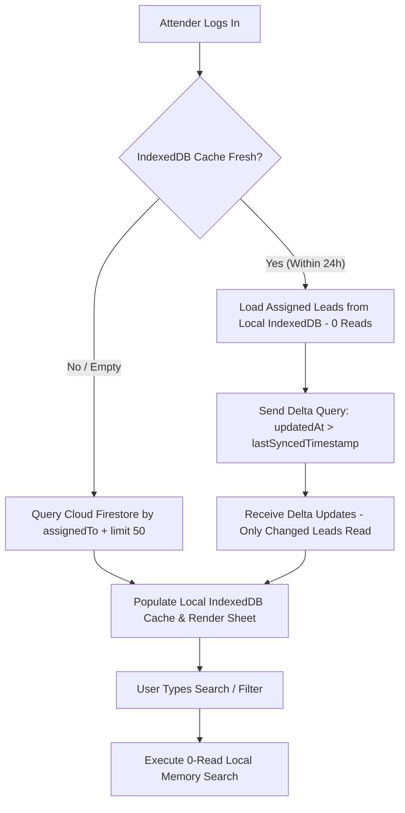

# Call Center CRM: Lead Search & Caching Architecture Strategy

## Executive Summary
This document specifies the optimal architecture for searching, caching, and serving lead records in the **TGF Call Center CRM**. The goal is to maximize performance and data visibility for attenders while minimizing Firestore database reads, writes, and costs.

---

## 1. Problem Statement: The Monthly Cache Flaw
Historically, call center lead records were partitioned by month in Firestore (`callCenterCache/2026-06`, `callCenterCache/2026-07`, `callCenterCache/2026-08`).

### Critical Limitations:
1. **Data Loss / Visibility Gaps:** Attenders have assigned leads spanning multiple months. Querying only the current month partition hides older active leads from the attender's view.
2. **Exponential Read Scaling:** Reading all monthly partitions on session load forces the client to download $N$ partition documents every login, causing costs to grow continuously over time.
3. **Overhead on Search:** Performing full client-side searches across all historical months requires downloading thousands of un-indexed records into browser memory.

---

## 2. Evaluation of Caching & Query Strategies

| Strategy | Reads on Login | Search Cost | Writes | Scaling Limit | Data Visibility |
| :--- | :--- | :--- | :--- | :--- | :--- |
| **A. Legacy Monthly Cache** | $N$ Month Reads | 0 Reads (Local) | 1 Write | Grows monthly | ❌ Partial (Hides old leads) |
| **B. Single Attender Cache Doc** | 1 Read | 0 Reads (Local) | 1 Write | ⚠️ 1MB limit (~3,500 leads) | 100% Complete |
| **C. Enterprise Delta Sync** | 0 to 2 Reads | 0 Reads (Local) | 1 Write | Unlimited | 100% Complete |
| **D. Paginated Server Indexing** | 50 Reads / Page | 1 Read (Targeted) | 1 Write | Unlimited | 100% Complete |

---

## 3. Recommended Architecture: Hybrid Enterprise Delta Sync

The optimal strategy combines **Server-Side Indexing** with **Client-Side IndexedDB Delta Caching (24h TTL)**.



### Key Pillars:

### 1. Initial Session Load (Paginated Top 50)
* When an attender logs in, the system fetches the **50 most recent/priority leads** assigned to that attender:
  ```javascript
  query(
    collection(db, "contacts"),
    where("assignedTo", "array-contains", attenderId),
    orderBy("lastCalledAt", "desc"),
    limit(50)
  )
  ```
* **Cost:** **50 Reads** (Initial setup) or **0 Reads** (if cached in IndexedDB).

### 2. Delta Synchronization (`updatedAt > lastSynced`)
* Rather than re-downloading thousands of records, the app queries for leads updated since the attender's last active session:
  ```javascript
  query(
    collection(db, "contacts"),
    where("assignedTo", "array-contains", attenderId),
    where("updatedAt", ">", lastSyncedTimestamp)
  )
  ```
* **Cost:** **0 Reads** if no leads changed, or **$K$ Reads** where $K$ is the exact number of modified records.

### 3. Server-Side Composite Indexing for Filters
* Filters (e.g. `Status = Callback` or `Source = Facebook`) utilize Firestore cloud composite indexes to return top 50 matching leads directly from the database without loading all records.

### 4. Direct Targeted Phone & Name Search
* Searching by exact phone number or name uses a targeted indexed query:
  ```javascript
  query(
    collection(db, "contacts"),
    where("assignedTo", "array-contains", attenderId),
    where("normalizedPhone", "==", searchQueryDigits)
  )
  ```
* **Cost:** **1 Read**.

---

## 4. Local Storage & Background Cache Lifecycle

### Time To Live (TTL): **24 Hours (Daily Shift Scope)**
* **Active Work Shift (24h):** Leads loaded during the day remain cached in browser **IndexedDB** (`tgf_attender_logs_${attenderId}`). Navigating, switching tabs, or re-filtering today's leads costs **0 Firestore Reads**.
* **Instant Mutation Update:** When an attender submits a call entry or updates a remark, the local cache entry for that contact is updated **instantly in memory and IndexedDB**.
* **Daily Expiration / Shift Reset:** At 00:00 (Midnight) or on next day's first login, stale cache expires, triggering a fresh delta query for the new day's callback queue.
* **Storage Cap (LRU Eviction):** Local IndexedDB is capped at **2,000 active contacts** per attender. Least Recently Used (LRU) records automatically evict to preserve browser memory.

---

## 5. Security & Access Control

Strict security is enforced at the Firestore Database level, guaranteeing attenders can **only** access records explicitly assigned to them:

```javascript
rules_version = '2';
service cloud.firestore {
  match /databases/{database}/documents {
    match /contacts/{contactId} {
      allow read, write: if request.auth != null && 
        (request.auth.uid in resource.data.assignedTo || 
         resource.data.attenderId == request.auth.uid ||
         request.auth.token.admin == true);
    }
  }
}
```

---

## 6. Financial & Read/Write Cost Breakdown

| Operational Event | Firestore Read Cost | Firestore Write Cost |
| :--- | :--- | :--- |
| **Session Open (Cached)** | **0 Reads** | **0 Writes** |
| **Session Open (Fresh/Delta)** | **0 to 50 Reads** | **0 Writes** |
| **Text/Phone Search** | **0 Reads** (Memory) / **1 Read** (Cloud) | **0 Writes** |
| **Applying Status/Tag Filters** | **0 Reads** (Memory) / **50 Reads** (Cloud) | **0 Writes** |
| **Submitting Call Entry** | **0 Reads** | **1 Write** |

*Estimated Monthly Cost per Attender:* **<$0.05 / month** (Under 100 reads per active shift day).
